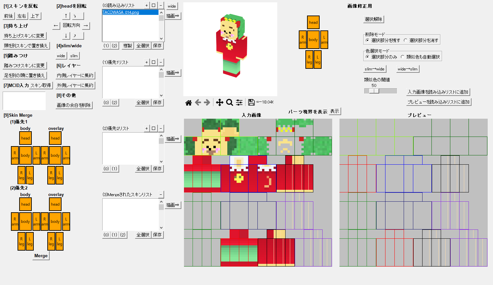

# SkinEditor
マインクラフトスキンの反転と頭の回転などの一括処理ができるプログラム

## function
### 一括処理機能
- リストには[+]でスキンを追加できる(複数選択可能)
- [□]でディレクトリ内の全てのpngを取得できる
- [-]でリストから削除
- 32x64のスキンは自動的に64x64に変換される
- 保存はリストで1個のみ選択された時のみファイル名で保存し、複数選択されている際はディレクトリを選択し、その中に選択されたスキンが保存される。
- リスト間のスキン移動は[0],[1],[2]のボタンを押す


| 番号|機能 | 説明 |対象|
| ----|---- | ---- |----|
| [1]|スキンを反転 | スキンを反転 |(0)読み込みリストで選択|
| [2]|headを回転 | スキンの頭を回転 |(0)読み込みリストで選択|
| [3]|持ち上げスキンに変更 | 頭が胴体に収まるように下移動。顔はそのまま |(0)読み込みリストで選択|
| |頭を別スキンで置き換え| スキンの頭をファイル選択したスキンの頭で置き換える|置き換えられるスキン:(0)読み込みリストで選択<br>置き換えるスキン:ファイルダイヤログで選択|
| [4]|wide | slim/wideの判定をし、slimスキンをwideに揃える|(0)読み込みリストで選択|
| |slim | slim/wideの判定をし、wideスキンをslimに揃える|(0)読み込みリストで選択|
| [5]|踏みつけスキンに変更 | 頭が足の下に収まるように上移動。顔はそのまま |(0)読み込みリストで選択|
| |足を別の頭で置き換え| スキンの足先をファイル選択したスキンの頭で置き換える|置き換えられるスキン:(0)読み込みリストで選択<br>置き換えるスキン:ファイルダイヤログで選択|
| [6]|内側レイヤーに集約 | 外側レイヤーを内側レイヤーに集める。ただし、外側レイヤーで上書きする|(0)読み込みリストで選択|
| |外側レイヤーに集約 | 内側レイヤーを外側レイヤーに集める。ただし、外側レイヤーで上書きする|(0)読み込みリストで選択|
|[7]|MCIDスキン取得|入力したMCIDからスキンを取得する。複数入力の時は改行|(0)読み込みリストに追加される
|[8]|余白の削除| スキンのpng画像のスキン描画に関係ない領域を削除する|(0)読み込みリストで選択|
|[9]|Skin Merge|優先2のスキンの上に優先1のスキンを重ねる。パーツ毎に取捨選択可能。<br>優先1にn個、優先2にm個のスキンがあるとき、nm個のスキンが生成される。|(1)優先1のスキンと(2)優先2のスキン|

### スキンごとの処理(画像修正用)
- 入力画像内で範囲選択
- 選択領域のみ残す、もしくは消すことが可能
- 類似色の一括削除も可能
- 個別にスキンのwide/slimを変換可能

## installation
### 実行ファイル(.exe)を使う場合
windowsのみ対応  
/release/latest  
[リンク](https://github.com/TACOWASA059/SkinEditor/releases/)
からapp_plot.exeをダウンロード  
そのまま実行
###  pythonから実行する場合  
####  requirements  
* python3.8.10
* tkinter
###  scripts
```bash
cd SkinEditor
cd scripts
pip install -r requirements.txt
python3 app_plot.py
```
